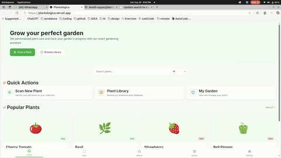
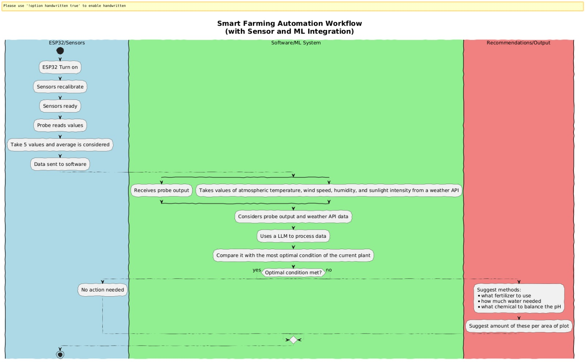
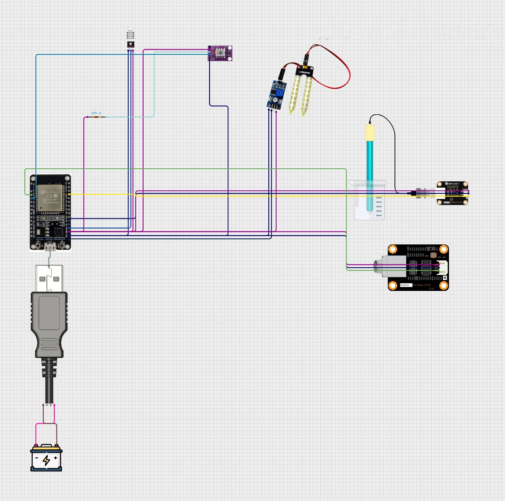

# 🌱 Plantologica: Smart IoT Soil Health Monitor

## 📌 Abstract

**Plantologica** is a smart IoT-powered soil monitoring system integrated with a mobile application to help farmers and plant owners maintain optimal plant health.

The system combines an **ESP32 microcontroller** with soil sensors to measure key parameters:

* 🌊 Soil Moisture
* 🌾 Nutrient Concentration (NPK)
* ⚖️ Soil pH Levels

Collected data is transmitted to a mobile application, where users select the plant type. The app compares **real-time soil readings** with **predefined optimal ranges** and presents results in a clear **two-column format**:

* **Left Column:** Ideal values required by the plant
* **Right Column:** Current soil condition

The application then generates **actionable recommendations**:

* 💧 Watering strategies when soil is dry
* 🌿 Fertilizer type, amount, and usage instructions when nutrients are insufficient
* 🧪 Soil treatment methods for pH imbalance

Thus, **Plantologica acts as a digital assistant for precision agriculture**, reducing guesswork, improving yield, and supporting sustainable farming practices.

---

## 🎥 Demo



---

## 🚀 Key Features

* 📊 Real-time soil monitoring (Moisture, NPK, pH)
* 🌱 Plant-specific optimal ranges
* 🧾 Clear comparison: Ideal vs. Actual soil condition
* 💡 Intelligent recommendations (water, fertilizer, soil treatment)
* 📈 *(Future)* Historical trends & data visualization
* 🌦️ *(Future)* Weather-based irrigation planning
* 🤖 *(Future)* Automated smart irrigation system

---

## 🛠️ System Components

### 1️⃣ Hardware

* **Controller:** ESP32 (Wi-Fi + Bluetooth)
* **Sensors:**

  * Soil Moisture Sensor 🌊
  * NPK Sensor 🌾
  * Soil pH Sensor ⚖️ *(optional in prototype)*

### 2️⃣ Mobile Application

* 📲 Plant type selection
* 📲 Fetch real-time sensor data (via Bluetooth/Wi-Fi)
* 📲 Display comparison (Optimal vs. Actual values)
* 📲 Generate actionable suggestions

### 3️⃣ Knowledge Base

* Database of optimal soil ranges per plant species
* Rule-based recommendation engine (prototype)
* *(Future)* AI/ML-powered smart insights

---

## 🛤️ Roadmap

### ✅ Phase 1 – Hardware Prototype

* ESP32 + Soil Moisture Sensor setup
* Arduino sketch for reading values

### ✅ Phase 2 – Basic Mobile App

* Plant selection UI
* Side-by-side comparison layout

### ✅ Phase 3 – Communication

* ESP32 → Mobile App via Bluetooth/Wi-Fi

### ✅ Phase 4 – Smart Suggestions

* Rule-based logic (e.g., *If Nitrogen < required → Suggest Fertilizer X*)
* Future integration with cloud databases

---

## 📲 Prototype Focus

* ESP32 + Soil Moisture Sensor
* Real-time moisture measurement
* Mobile app comparison with ideal plant values
* Simple rule-based watering/fertilizer suggestions

---

## ⚡ Tech Stack

* **Hardware:** ESP32, Soil Moisture Sensor, NPK Sensor, pH Sensor
* **Firmware:** Arduino IDE (C/C++)
* **Mobile App:** Flutter / React Native / Native Android
* **Communication:** Bluetooth / Wi-Fi (MQTT/HTTP)
* **Database (Future):** Firebase / Supabase / SQLite

---

## 📖 Example Workflow

1. User selects plant type (*e.g., Tomato*) in app
2. App fetches soil data from ESP32
3. App compares values with tomato’s ideal requirements
4. If nutrients are low → Suggest fertilizer type & dosage
5. If moisture is low → Recommend irrigation strategy
6. Farmer acts → Soil balance restored → Higher yield 🌱

---

## 🖼️ System Architecture

```
[Soil Sensors] → [ESP32 Controller] → [Mobile App] → [User Recommendations]
```


---

## 📂 PPT Presentation

%20\(1\).pptx)

---

## 🌟 Future Enhancements

* 📊 Data history with interactive graphs
* 🌍 Weather-based smart irrigation
* 🤖 AI-powered crop care assistant
* 🚜 Multi-plant farm monitoring
* ☁️ Cloud integration for remote access

---

## 🤝 Contribution

We welcome contributions to improve Plantologica!

* Fork the repo
* Create a feature branch
* Submit a pull request

---

## 📜 License

Licensed under the **Apache License** – free for academic, personal, and commercial use.

---

## 👨‍💻 Team Plantologica – SIH 2025 Internal Hackathon

* **Shadil AM** – Project Manager & Developer
* **Abhiram** – Developer
* **Afiq** – Developer
* **Nayana** – Presentation Expert
* **Nirajan** – Hardware Expert
* **Ribin** – Hardware Expert

💐 **Special Thanks to Gopika for supporting our team.**

🚀 Open to collaboration with IoT, agriculture, and mobile app developers.


